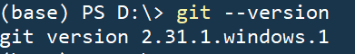
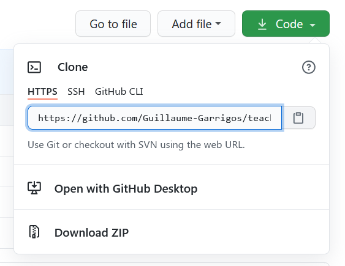
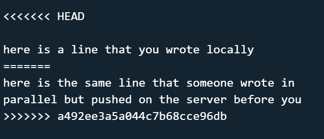

# Using Git with Github

This short tutorial explains how to use Git to access, modify and share files on Github.

## Install

1. First of all, you need to install git on your computer: https://git-scm.com/book/en/v2/Getting-Started-Installing-Git

2. Check that git has been correctly installed: 

   - On Mac or Linux use the command `git --version` , which should return the version of git installed on your computer
   - On Windows, after installing, you should have access to a "Git Bash" installed in Programs/Git. This launches a prompt in which you can use all the commands below.

   

3. Give to git the access to your Github credentials:

   - On Windows, run `git config --global credential.helper manager`
   - On MacOS, run `git config --global credential.helper osxkeychain`
   - On Linux, see this page https://stackoverflow.com/questions/5343068/is-there-a-way-to-cache-github-credentials-for-pushing-commits

   

## Downloading a project which already exists in Github

1. Go in the Github repository you want to work on, click on the download/code button and copy the HTTPS adress which is provided. it should be the adress of the webpage you're in, followed by   `.git`
   
2. In your computer, in the folder of your choice, open a command line and use: `git clone https://whatever_link_you_just_copied.git`
3. This  will download a folder named `repository_name`  containing the last version of what's on the server, plus a `.git` folder that you can ignore. You can rename/move this `repository_name` folder if you want, it won't break anything. But do not touch the `.git`  subfolder!


## Day-to-day workflow to contribute on the project

Ok now you're ready to start!

In your workflow, you'll need to execute git commands from *within* the folder of the repository you're working on.

1. Before starting to do modifications, update (in the git langage we say "pull") the lastest version of the project with `git pull`
2. Now you can start working locally on your files as usual, using your favorite editor(s),  whatever it is. Once you're done working, or say that you have achieved a significant amount of work, you are ready to send your modifications on the server. Save your files,  and close your text editors  (sometimes editors while open keep weird hidden temporary copies of the file, which might create problems once in a while?)
3. "Commit" all your modifications : this means doing a tiny package of modifications you've done for one or many files in the folder. A commit also comes with a short  title/description, which doesn't have to be long. To do this : `git commit -am "a short description of what I did"`
4. Upload your commit : `git pull` (you need to pull again before pushing, because who knows what happened while you were working) then `git push`


If there is no problem, you're done! You can check that your commit is now online on Github.

Instead, it could be that there is a conflict. This typically occurs if someone else on the project pushed a commit **after**you started to work, but **before** you tried to pull/push). In that case here is what happens:

4. You want to upload your commit, but:
   - *Conflict detection* :  `git pull` returns an error "Automatic merge failed; fix conflicts and then commit the result." It is going to tell you which files have conflicts. 
   - *Conflict resolution* : You simply open the said file(s) with your favorite editor, and you are gonna see that in the file there are some lines like :

      

      Your job is to delete all this and keep the lines that what you want. That's as simple as it sounds!
   
   - *Getting back on tracks* : You do a new commit, because you just modified the files again:

      `git commit -am "solving conflicts" `


      Then you can  safely pull-push to the server: (again you pull before push, just in  case something happened while you were resolving the conflicts..)

      `git pull`

      `git push`

      That's pretty much it!

In other words, your workflow is the following:

1. `git pull`
2. Doing local changes
3. `git commit -am "a short description of what I did"`
4. `git pull`
   - If no conflicts, conclude with `git push`
   - If conflicts, resolve the conflicts and go back to 2.

### Asking git to track new files

One last thing is that : if you *create* a new file in the repository,  Git will ignore it. 
For instance if you work with .tex documents you'll notice that all the .aux, .pdf files created by latex are not on the server. This is because Git do not keep track of them, and it will be the same of your new file. To tell Git that you want this new file to enter the danse, you just do a  command before commiting :

`git add myfilename.txt`

If you have a **lot** of files to add to the git tracker, and do not want to add them all one by one, you have some workarounds:

- `git add *.txt` adds all the files with the extension `.txt`. You can use this kind of syntax to add all the files from a subfolder for instance.
- `git add --all` adds **all** the files you have in your folder. Be sure of what you do when using it.


## Using git to do local version control

Git is not a tool that you use only to communicate with Github. You might have some projects where you would like, sometimes, to go back in time to see what were your files looking like X months ago. Git is the perfect tool for that.

   1. We assume that you already have a certain `folder` containing all your project.
   2. In this folder, execute

      `git init`

   3. Tell Git to start to track the files you want. All files? Some files? This is up to you to decide, see the previous section to see how to do that. Just keep in mind that Git is meant to work with text documents, and that keeping track of changes in non-text-based formats (like .pdf) requires a lot of memory.

   4. Now you can do commits within your projects whenever you want. The difference with when you use Github is that your changes are saved only locally, and never shared with anybody.

   5. With the command

      `git log --left-right --graph`

      you can see a tree of all the previous commits you did. Each commit is described as

      ```
      commit 4dd7f5c948fdc11814041927e2c419283f5fe84c
      Author: Your Name <your.name@manchester.ac.uk>
      Date:   Mon Jun 26 10:21:48 2017 +0100

      Write introduction
      ```

      If you wanna compare your current file with how it was when you did this commit, do

      `git diff 4dd7f5c948fdc11814041927e2c419283f5fe84c`

   6. The above method is honestly not super friendly or visual. Thankfully, there are softwares allowing for a nice visualisation of all your previous commits. For instance the text editor Visual Studio Code has a feature called **Timeline view** which is pretty neat, and helps you to visualize all the commits you did in a file.
   
      


## Sending a local project onto Github

   1. We assume that you have a local project with Git initialized, as explained in the previous section.

   2. Go on Github, and create a new empty repository.

   3. Follow the instructions to "push an existing repository from the command line", which consists in executing from your local folder three commands :

      ```
      git remote add origin https://github.com/your_name/your_project_name.git
      git branch -M main
      git push -u origin main
      ```

   4. Think about adding a README.md in your folder, this is what Github automatically reads to display information on the Github webpage.


## Final comments

This is an extremely summarized version of what can/should be done with git, and I silence a lot of details about what those commands *actually* do. But I think it is a good starting point for total begginers like me.


### References

- https://gcapes.github.io/git-course/03-history/
- https://docs.github.com/en/github/importing-your-projects-to-github/adding-an-existing-project-to-github-using-the-command-line


