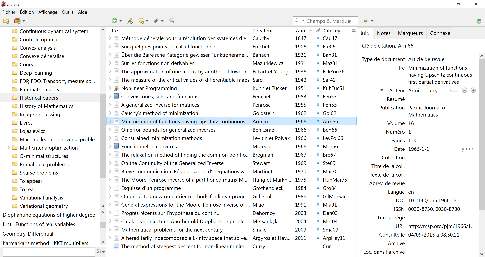
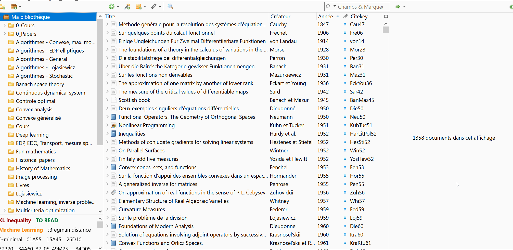
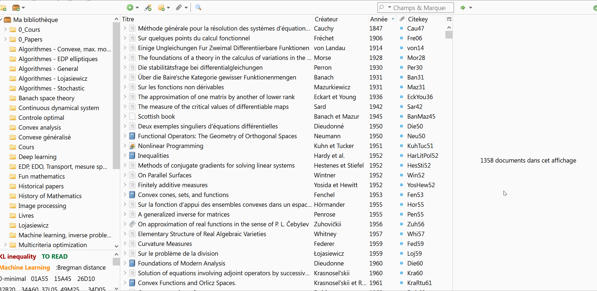
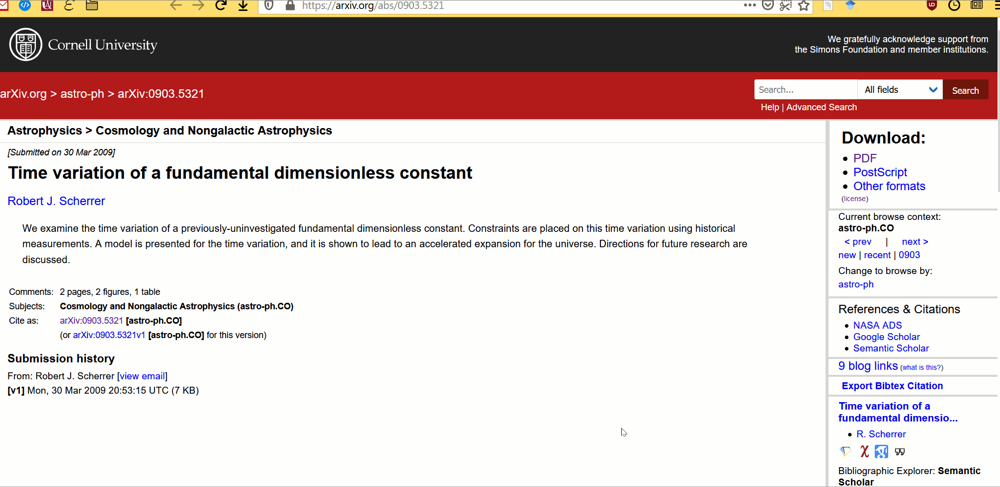
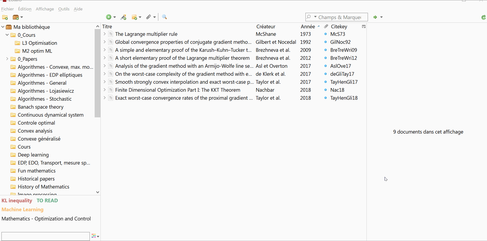

# Zotero

Zotero is a software helping you to:

- **Store** your academic papers (.pdf, .djvu, etc) in an orderly manner
- **Manage** your papers by storing them in (possibly multiple) collections
- Add tags and sticky notes to papers
- Display all the necessary metadata (journal name, publication year, etc)
- **Harvest for you** all this metadata from websites (arXiv, Elsevier, etc) in one click
- Effortlessly **create bibliography** files for TeX, BibTeX, etc

| A quick view on Zotero |
| --- |
|  |
| Left column: A list of collections (looking like folders). Center column: A list of papers within the "Historiacal papers" collection. Right column: More details about one paper. |

## What it looks like to use Zotero

| Browsing across your papers and opening one |
| --- |
|  |
| Every document can be stored in a "collection", which makes it easy to find. By clicking on a document, it opens the attached file (here a .pdf).  |

| Using the research bar to find a paper |
| --- | 
|  |
| You can do a research based on the title or the authors.  |

| Getting a paper from arXiv |  |
| --- | --- |
|   |
| Thanks to the Zotero plugin, you can directly download a paper in one-click into your database. The .pdf will be stored locally on your computer, the metadata about it will be automatically downloaded. | 

| Getting a paper from onther places, like Google Scholar |  |
| --- | --- |
|   |
|  It works on most academic websites, like arXiv, Google Scholar, or any official journal website (provided you have access to it). We'll see later how to do when you have access to the metadata only, but not the document itself. |

| Exporting one or a group of paper citations to the paperboard |
| --- |
|  |
| Since Zotero automatically download and store the metadata of your articles, it can also generate bibliographical data, in a lot of formats (here the bibtex format). |

