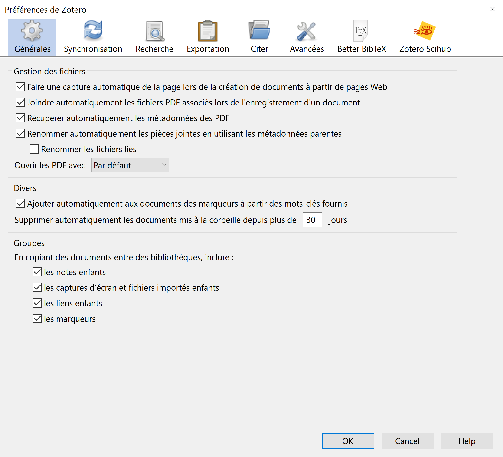
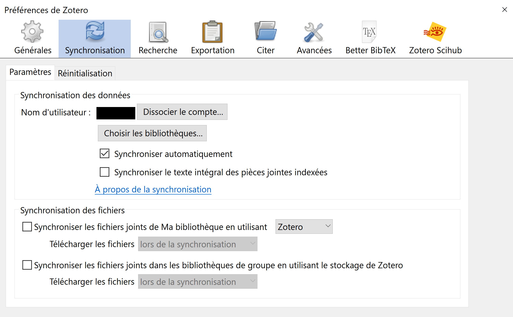
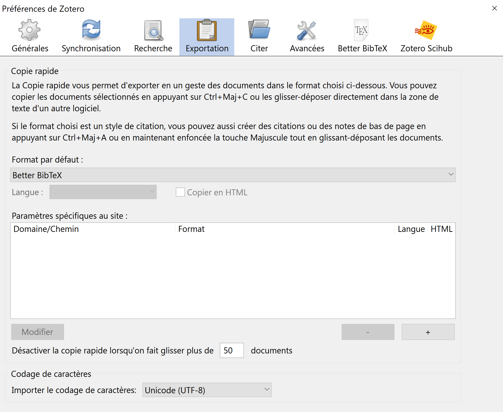
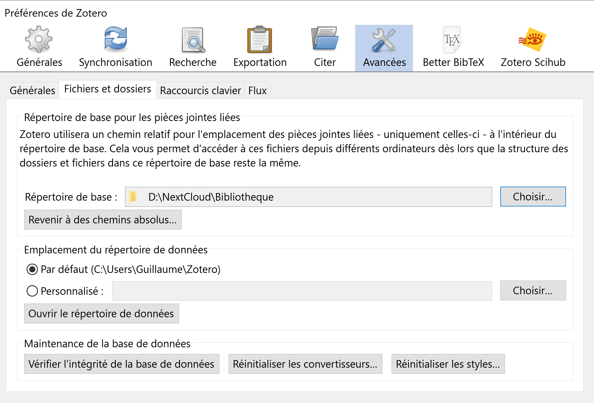
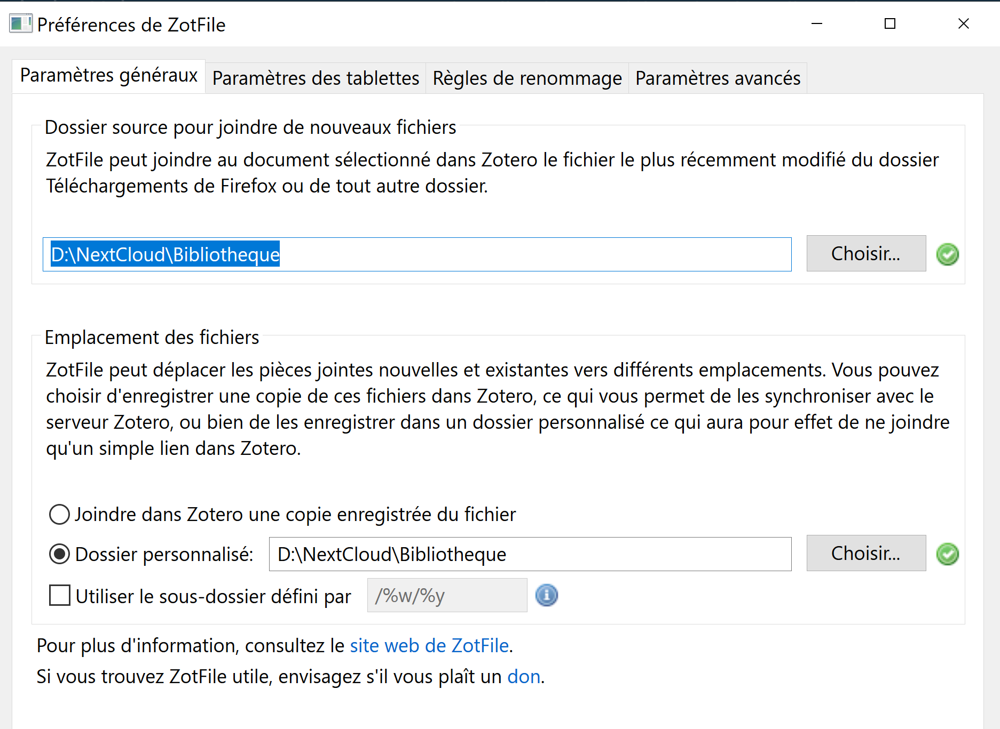
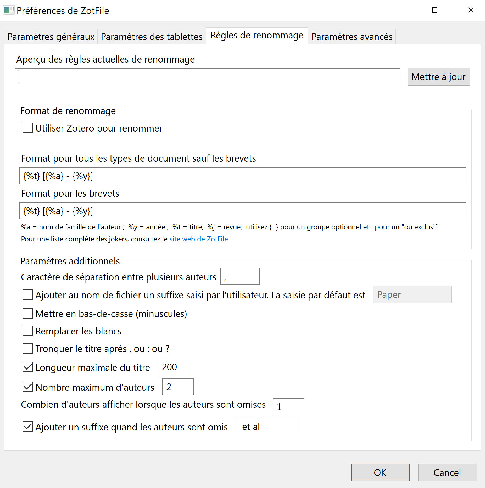
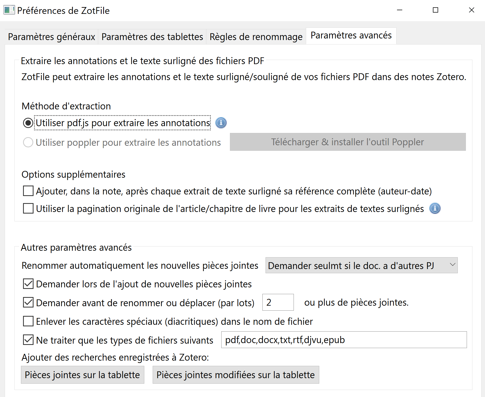
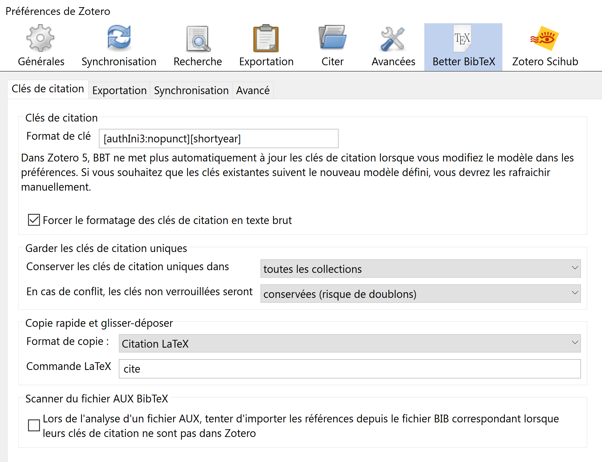
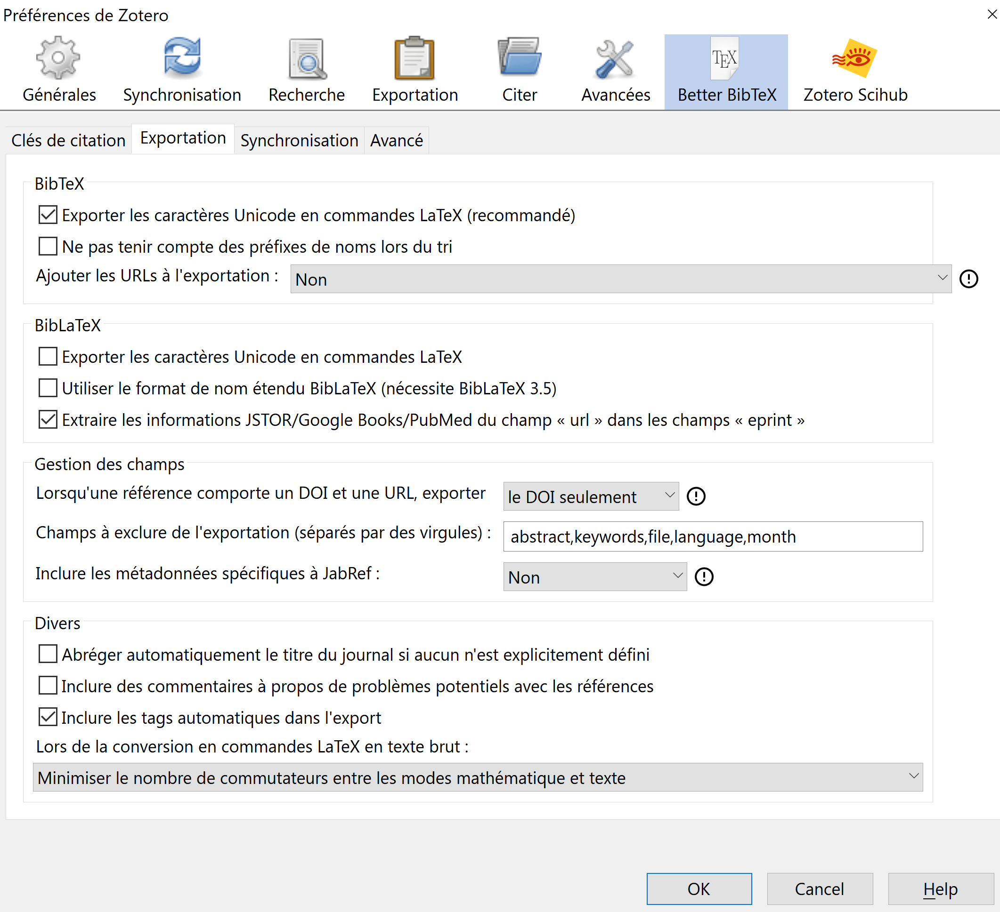

# Installing and setting up Zotero and its addons

## Getting started

- Get the last version of Zotero and install it [https://www.zotero.org/download/](https://www.zotero.org/download/).
- Get the Zotero connector corresponding to your web Browser (Firfox, Chrome, Safari) and install it.
- Get a few useful addons for Zotero :
  - [Zotfile](http://zotfile.com/) which helps to automatically rename the pdfs you'll download, and eventually synchronize your library if you use Zotero on different computers. UPDATE: Zotfile is no longer maintained and is not compatible with Zotero >= 7.0. It still works fine with Zotero 6 though. IT seems that alternatives exist for Zotero 7, see [here](https://forums.zotero.org/discussion/116679/zotero-7-and-zotfile).
  - [Better Bibtex](https://retorque.re/zotero-better-bibtex/installation/) which provides helpful tools to export your bibliography.
  - [Zutilo](https://github.com/wshanks/Zutilo/releases) which provides advanced control on how to generate reference keys in your bibliography.

  To install those addons, follow this procedure:
  - Download the .xpi of the addon (if you use Firefox, make sure to right-click and save the .xpi file, not just clicking it).
  - In Zotero : Tools > Add-ons > Extensions
  - Click on the gear in the top-right corner and choose ‘Install Add-on From File…’
  - Choose .xpi that you’ve just downloaded, click ‘Install’
  - Restart Zotero

- Create an account on [Zotero.org ](https://www.zotero.org/user/login/). This will be useful to synchronise your library between different computers, or simply to keep a copy of your library on Zotero.org servers.

## Setting up the parameters

Here I store the parameters which I find to be the most useful. 

In Zotero > Edit > Preferences : 

 

The above parameters ask Zotero to automatically download a pdf when possible from a website.

 

Here you can give your Zotero.org account credentials. By doing so, a copy of the metadata (not the pdfs) of all your documents will be kept on Zotero.org servers. This is useful:
- If something bad happens to your pc, you'll have an extra save somewhere
- If you want/need to work with different computers, this feature will allow you to keep track of all changes in your library from one Zotero to the other. It might also be useful in the future if you happen to change your computer! If youthink that you do not need this, you can uncheck the `automatic sync` box.

 

This tells Zotero to use the powerful Better Bibtex addon to export documents.

 

The above set of parameters is critical if you ever want to use Zotero on a new computer. 
It basically sets where and how the files should be stored.
The way it works is the following: you create in your computer a big new FOLDER (call it Library if you want) which will contain all your pdfs. This folder can be in a shared folder if you want. In my case this FOLDER is `D:\NextCloud\Bibliotheque`.
It is important that you ask for **relative** paths. By doing so, if you ever install Zotero on a different computer, you can repeat the same procedure (with eventually a *different* path for the big basis FOLDER) and not break your links.

Now go in Zotero > Tools > Zotfile settings :

 

Here you have to specify the path to the very same FOLDER we just mentioned above.

 

Here is where we decide how shoud Zotero+Zotfile should rename the documents we will download.
In my case, I want my files to be named like

`Title [Author1, Author2 - Year].pdf`

To do so, I ask for the following format:

`{%t} [{%a} - {%y}]`

Of course you can setup your own rule: for this, give a look [here](http://zotfile.com/index.html#renaming-rules). 
My only advice is: try to make a rule as general as possible, which will work for all the documents you'll handle: articles, books, etc. I think the best is to keep a simple combination of Title+Authors+Year.

The other parameters ask that if there is more than two authors, `{%a}` becomes `First_author et al`.

Now go back to Zotero > Edit > Settings :

 

 

Here we will tell to Zotero how to define CiteKeys in latex. Remember that for citing an article in Latex, you need to define the bibliographical reference (this is something Zotero will do automatically for you) but you also need to choose a tiny name for this reference. For instance, for a paper written by Fenchel in 1953, I will choose to call it by `\cite{Fen53}`. So here we are going to tell Zotero what are the rules we want to follow for this.

This is done through the Key Format setting.
On my side, I want :
- The first three letters of each authors
- The first letter must be capitalized
- the key ends with two digits corresponding to the year

For instance, I want my keys to look like `Fen53` or `BolDanLewShi07`.
I obtain this by asking for the format:

`[authIni3:nopunct][shortyear]`.

You can of course choose your own rules, see [here](https://retorque.re/zotero-better-bibtex/citing/#configurable-citekey-generator) for more details.

We are almost done!

- Go now in Zotero > Tools > Zutilo Settings. 
Hide everything, except "Fast copy" and "Fast copy (alt 1)" that you put to Zotero's menu.
- Go in Zotero > Edit > Export > Defaut Format and select "Better Bibtex \cite{Citation Key} Quick Copy"
- Go in Zotero > Edit > Setting > Advanced > Config editor, and type `export.quickCopy.setting` in the research bar
- Right click on the line, and copy/paste the value somewhere. It should look like `export=a515a220-6fef-45ea-9842-8025dfebcc8f`
- Type `extensions.zutilo.quickcopy_alt1`, Right-Click the line > Modify and paste the value you just copy/pasted
- Go back to Zotero > Edit > Export > Defaut Format and put back the selection to "Better Bibtex"

Now by right-clicking one or many documents, you'll have access to the Bibtex export and its CiteKey.

